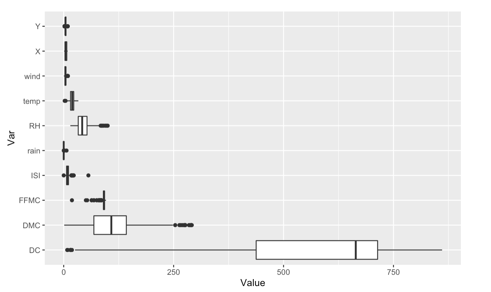
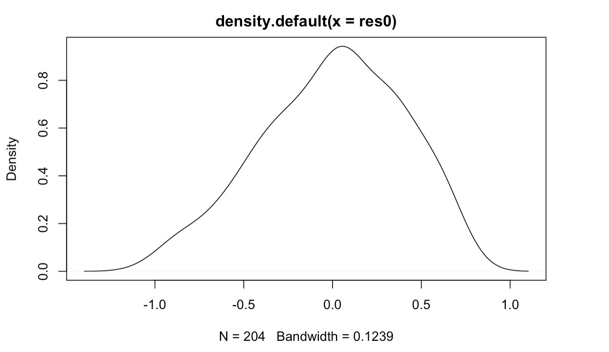
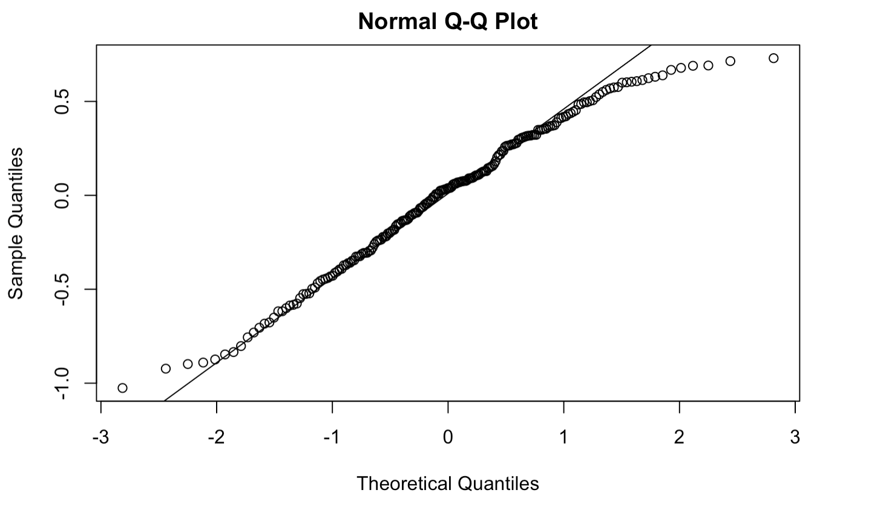
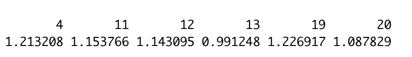
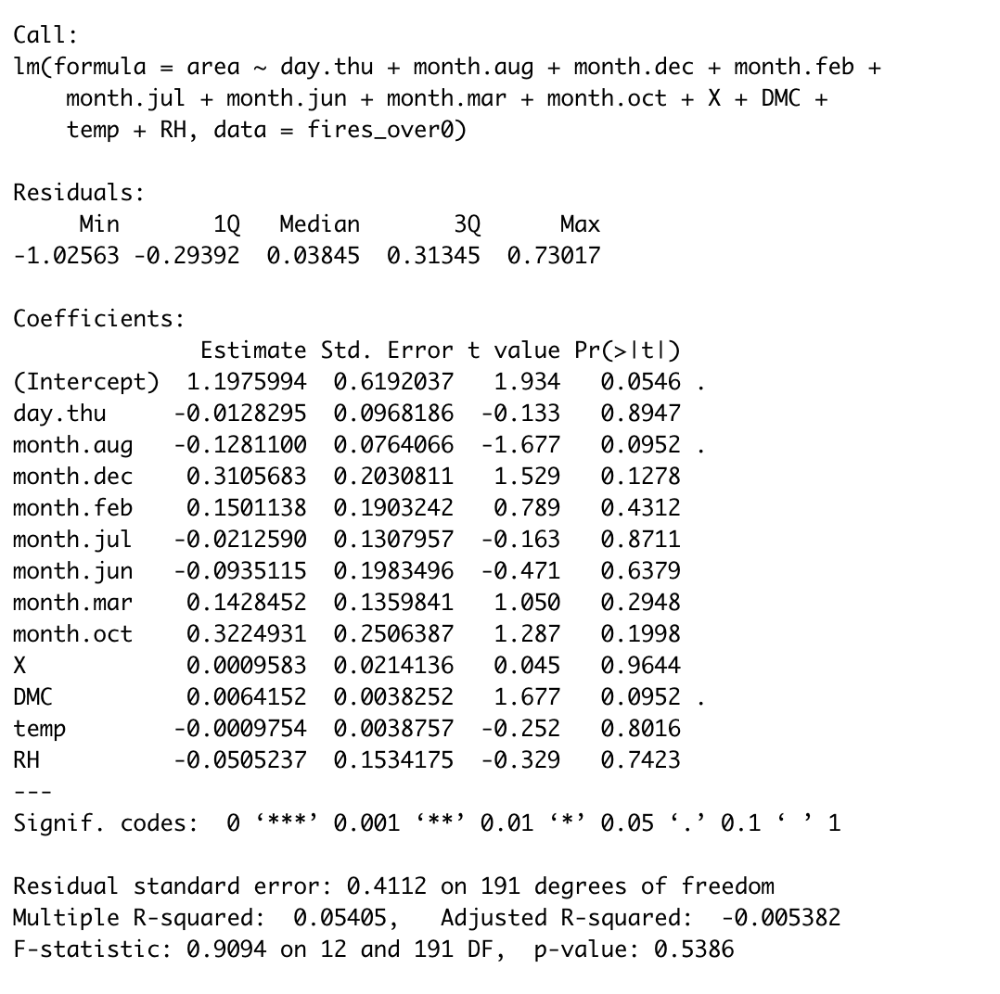

```{r setup, include=FALSE}
knitr::opts_chunk$set(echo=FALSE, error=FALSE, warning=FALSE, message=FALSE, fig.align = "center")
```


```{r loadData, include=FALSE}
# Libraries

library(DataExplorer)
library(visdat)
library(dplyr)
library(tidyr)
library(MASS)
library(psych)
library(AER)
library(mlr)
library(mice)
library(imputeTS)
library(ggplot2)
library(caret)
library (skimr)
set.seed(621)
```


# Abstract  
For the final assignment, the team will be looking at a dataset of forest fires identified in Montesinho Natural Park, located in the mountainous northeast of Portugal. The original paper was published by a nearby university with the intention of offering low-cost prediction based on available meteorological measurements. Their model used information collected in realtime to identify fires without more specialized equipment - sattelite imaging and smoke scanners.   

The objective is to build a model that predicts the burned area of the forest given the explanatory variables. Additionally, a temporal model could be developed to understand which day and weather patterns offer the highest risk conditions.  

# Keywords    
Regression modeling, forest fires, meteorological measurements  

# Introduction    

  Every year forest fires cause enormous amounts of destruction that results in the loss of human and animal lives and economical and ecological loss. In addition, unpredictable forest fires make it very difficult for fire departments to plan in order to have an appropriate amount of resources in order to effectively fight all the fires.  By creating a model that uses meteorological measurements such as wind and relative humidity, fire departments would be able to prepare better in order to fight fires more effectively and ideally decrease the amount of destruction that is caused each year by forest fires.  


# Literature Review  

**[A Data Mining Approach to Predict Forest Fires using Meterological Data](http://www3.dsi.uminho.pt/pcortez/fires.pdf) by Paulo Cortez and Anibal Morais** focused on using meterological data to predict smaller forest fires.  This study focused on meterological data because it can easily be captured through weather stations in real-time for low costs.  Other methods of infrared scanning and satellite are more expensive.  Their work used a SVM, neural network, multiple linear regression and other data mining methods in order to predict the weather conditions that created small fires.  While small fires are much more common than large fires, a drawback to this study is it doesn't predict when large fires will occur.  The outcome of this study helps fire department manage resources by reaching fires more quickly.

The **[Wildfire Burn Area Prediction paper](http://cs229.stanford.edu/proj2019aut/data/assignment_308832_raw/26582553.pdf) by Adam Standford-Moore and Ben Moore]** aimed to predicate the burn area of wildfires.  They used Kaggle data of historical wildfires in the United States from 1992-2015 and UCI dataset of wildfires in Portugal including info on first start and end date, longitude, latitude, year, and fire cause.  The UCI dataset included weather features, which proved to be important in the modeling.  Unlike other groups, this paper took all of the historical fires and binned them into 10 groups according to the fire size.  They then sampled 4,000 fires from each bin in order to complete their modeling.  Some of the bins with smaller fire sizes were heavily overrepresented in the data and they did this in an effort to balance the data.  This group used various modeling approaches including SVM, Neural Networks, K-Nearest Neighbors, Decision Trees, Linear Regression and more.  The best performance came from the SVM.  The smaller fire sizes proved easier to predict, which alines with some of the other studies.  This study found the features related to weather were more predictive over the historical fire data.

The article, **[Predicting forest fires burned area and rate of spread from pre-fire multispectral satellite measurements](https://www.sciencedirect.com/science/article/pii/S0924271619302515) by Carmine Maffeia and Massimo Menenti]** had an interesting take away that their focus was almost solely on moisture in the plant life on the ground.  They focused on weather conditions in an attempt to determine how it would affect the moisture levels in plant life since plants will fuel fire.  Plants with less moisture with burn quickly.  They were attempting to come up with their own function to measure the moisture content by focusing on plant moisture at different levels on the ground (surface vs deeper levels of organic matter).  They used various satellite imaging resources which was different from other studies in that this data collection is more expensive.  It'd be interesting to see how this studies findings impacts towns and their ability to obtain data through more expensive collection routes. Our analysis will not include these expensive data sources and instead will focus on meterological measurements as inexpensive data sources.

# Methodology
## Data Overview
Below is the description and abbreviations of the variables of interest in the data set.  These abbreviations will be used throughout our paper.

|VARIABLE NAME|DEFINITION|
|--|----|---|
|X|x-axis spatial coordinate within the Montesinho park map: 1 to 9|
|Y|y-axis spatial coordinate within the Montesinho park map: 2 to 9|
|month| month of the year: "jan" to "dec" |
|day|day of the week: "mon" to "sun"|
|FFMC*|Fine Fuel Moisture Code index from the FWI system: 18.7 to 96.20|
|DMC*|Duff Moisture Code index from the FWI system: 1.1 to 291.3 |
|DC*| Drought Code index from the FWI system: 7.9 to 860.6 |
|ISI*|Initial Spread Index from the FWI system: 0.0 to 56.10|
|temp|temperature in Celsius degrees: 2.2 to 33.30|
|RH|relative humidity in %: 15.0 to 100|
|wind|wind speed in km/h: 0.40 to 9.40 |
|rain|outside rain in mm/m2 : 0.0 to 6.4 |
|area|the burned area of the forest (in ha): 0.00 to 1090.84 |  

*The FWI, or Fire Weather Index system, is an estimator developed in Canada for assessing fire risk. It ranges 0-20 and considers weather and fire conditions withing a critical period prior at the start of the fire.  The FFMC is a composite of rain, humidity, temperature and wind, DMC is rain, humidity and temperature, DC is rain and temperature, and finally ISI is a fire behavior index. One element of FWI, the buildup index, was not included as this is an indicator of the bulk fuel on the ground and not ascertainable from meteorology.  

Source : Cortez, Paulo & Morais, A.. (2007). A Data Mining Approach to Predict Forest Fires using Meteorological Data. 

## Data Overview & Exploration
Our dataset has 517 observations and 13 columns. None of the variables have any missing values.  All of the data are numeric except for day and month.  It is also interesting to note that our response variable, area, has a large range and the difference between the median (0.52) and mean (~12) seems to suggest there maybe outliers in our data.  

There are 247 observations were our target variable, area, is 0. This is not good for the assumptions of the linear model but we have little choice but to proceed. We assume that since the area is in hectare, 0 hectare means that the burned area is less than 1 hectare (107639 sqft.).    

The majority of fires that occurred happened during the months of August and September. Weekend days (Friday, Saturday and Sunday) were the most common days for fires to occur.  Looking at our variable rain, we were also able to see that this area in Portugal did not get much rainfall.  

Using `corrplot`, it is apparent that variables `X` and `Y` are positively correlated, which is perhaps spurious or owing to the lack of distinct values for these variables. `temp` is positively correlated with several of the indices. `temp` and `RH` are negatively correlated. It seems like our dataset has multicollinearity between the independent variables.  

In order to look further into the relationships between our response variable, area, and each of the predictor variables (See appendix for graphs) we imposed a linear fit (with 95% confidence band in grey) to each of the pairs of variables to understand the relationships. We see some outliers in the data. Please note, that there are instances where the response variable seems to fall below 0 - such as for area and FFMC. Once again, this may mean that the burned area was below 1 ha.

Using boxplots, we were also able to determine that the variables relative humidity(RH), Fine Fuel Moisture Code(FFMC), Duff Moisture Code(DMC) and Drought Code(DC) appear to have outliers in the data.




## Handing Missing Values
At first glance, there are no missing values in this dataset. However, only days with information about fires are added to the original dataset.The original paper mentions that readings spanned between January 2000 to December 2003, which would be a span of 1460 days as opposed to the 517 observations in the dataset. Since forest fires tend to be seasonal during a dry season, there may be a relationship to the data available for each month.  

The most observations are available for the month of August by a large margin.  March, July and February are the next most common months. January, May, and November have 2, 2, and 1 fires reported.

Looking at the August number, it's evident that multiple fires were happening per day during this time period.  This creates an interesting twist as multiple fires could strain firefighting resources and offers the prospect of considering a logistical or count as response variable if weather data were available for the missing dates.  It's also possible that the extra August observations there are duplicate entries as the observations were collected from two sources throughout the study.  

## Data Preparation  
#### Handling missing and outliers  
The very first in data preparation we will perform is handling missing data and outliers through imputation. We will use mice package to perform imputation here. MICE (Multivariate Imputation via Chained Equations) is one of the commonly used package for this activity. It creates multiple imputations for multivariate missing data. Also we will perform `nearZeroVar` to see if a variable has very little change or variation and not useful for prediction. The variable **rain** was removed during process as it was seen to not be useful for prediction.  

The variable month and day are categorical variables, having 12 and 7 classes. For modeling, we got to convert into set of dummy variables. We will use `dummyVars` function for this purpose that creates a full set of dummy variables.

#### Data Tranformations  
We use the package caret `preprocess` method using transformation as `YeoJohnson` which applies Yeo-Johnson transformation, like a BoxCox, but values can be negative as well.  This provides optimal data transformations for modeling.   

#### Testing & Training Separation  
Finally in this step for data preparation we partition the training dataset for training and test using `createDataPartition` method from `caret` package. We reserve 75% for training and rest 25% for validation purpose.    

# Experimentation and Results  
We tried various models including linear regression, robut regression, ridge regression and using various techniques.  Here is an overview of each model:      

## Linear Modeling     
We have transformed our data to fulfill the assumptions of linear regression. We will first test out linear regression on our data.  
**Model 1**:  Using all  of the variables this model returned an R^2 value of approximately 10% meaning the model account for 10% of the variance in the data.   
**Model 2**: Since we had some outliers of large forest fires we ran a model on only fires where the area burned is under 2 hectares.  
**Model 3**: Next we remove fires where burn area is 0 hectares.  This results in an R^2 of 19%. While we have a large number of records where area=0, this subset would be interesting to examine if the fire department is looking to predict large forest fires that would need substantial resources to deal with.  
**Model 4**: Finally we used the *leaps()* package, which performs an exhaustive search for determing the best predictors to use to predict our target variable.  According to leaps, **best model** includes the following predictors - Thursday, the months of August, December, January, July, June, March, October, September, spatial coordinates X & Y, relative humidity, temperature and duff moisture code. However, the adjusted R^2 for this model is still low at 5.7%, and is significant. Residual SE is also low at 0.6344.  
  
So far, our actual best model is when we leave out the records with burned area less than 0. We will proceed with this model. But before we entirely dismiss the second best model, produced by leaps, we will try to see if there are any other methods we could try using the predictors suggested by leaps to get a better model fit.  

## Robust Regression     
**First Robust Regression**  
Our dataset also had outliers - which we handled through imputation during data preparation. However, we also built a robust regression model to fully ensure that outliers and influential observations are not affecting our model. Robust regression is an iterative procedure that seeks to identify outliers and minimize their impact on the coefficient estimates.  

Upon comparing the RSE from our original linear model (linear regression model #4 - best.model) and the robust regression model, keeping all variables constant, it seems that our original linear model (linear regression model #4 - best.model) performance was better.  From here on, we will dismiss the best model produced by leaps and move forward with the subset where burned area is greater than 0 ha.   

**Large Fires Model**  
Upon revising the coefficients of our model (linear regression model #4 - best.model), it seems like the only signficant predictor for large fires at p <.05 level is DMC - a moisture code index that takes rates moisture content that takes into account rain, humidity and temperature. 
  
We tried to refine this model a little bit with the leaps package to see if we can get a better fit just for this subset. The leaps package suggested using 12 predictors to get the best model.  This resulted in our adjusted R^2 decreasing slightly, however we are seeing several significant predictors. We had flagged the dataset for multicollinearity previously and upon running the car() package to test for multicollinearity in our chosen regression mode - it seemed like there were aliased coefficients in the model suggesting perfect collinearity between certain IVs. Therefore, despite the lower adjusted R^2, we are choosing to move forward with this model as our best to avoid overfitting.  

## Regularized Model  
**Model 1:**  
One thing to note from our linear model, is the difference between the adjusted R^2 and R^2 - this indicates that there is still multicollinearity in our data (which we has observed with some of the IVs during EDA). This may result in overfitting i.e. overestimating some of the coefficients assigned to our predictors. Such a model, will not perform well in the unseen test data. Therefore, we perform regularization through ridge regression to overcome this issue.  

Ridge regression is an extension of linear regression where the loss function is modified to minimize the complexity of the model (Singh,2019). We used the **glmnet()** package to build the regularized model.    

One of the major differences between linear and regularized regression models is that the latter involves tuning a hyperparameter, lambda. for our model, we will see what the best lambda is.  

We can see that our R^2 for the regularized model has decreased which suggests that the ridge model has not improved the original model, rather deteriorated its fit. 


## Select Model  
We have chosen the **Large Fires Model** to be our best model.  Before finalizing this choice, we will analyze the diagnostic plots for our chosen model.  The diagnostic plots suggest that the residuals are normally fitted. Therefore, this is our final model. 

  
    
  
## Predicting on the Test Data

We will use out final model to predict the burned area from forest fires on our fire test, and view the results for the top rows to see if the numbers make sense:




## Discussion and Conclusion  
The purpose of this study is to identify forest fires in Montesinho Natural Park and predict the area (in ha) that is likely to be affected, given weather conditions. Because our dataset categorized all small forest fires in this region(anything less than 1 ha) as 0, we decided to limit our study to only evaluate the area for large fires (area above or close to 1 ha).  
  
Our model indicates that the most significant predictor of larget forest fires (in terms of forest fires) is DMC. The Duff Moisture Code Index,is a numeric rating of the average moisture content of loosely compacted organic layers of moderate depth. In addition, it also seems from our model that large forest fires may also be likely to occur during the months of December and October in this region. This was surprising initially given that we were seeing such large numbers of forest fires in August during EDA. However, our final models seems to predict a significant but a weak negative relationship between large forest fires for August. This maybe because that there are higher numbers of small forest fires in the month of August rather than large ones. This is definitely an interesting insight that could be investigated in a future study.   
  
We hope this study could be used to improve disaster management and prevent significant damage from forest fires in Montesinho Natural Park in Portugal.  
 



# References  
1. Cortez, Paulo & Morais, A.. (2007). A Data Mining Approach to Predict Forest Fires using Meteorological Data.   
2. Stanford-Moore, A., &amp; Moore, B. (n.d.). Wildfire Burn Area Prediction. http://cs229.stanford.edu/proj2019aut/data/assignment_308832_raw/26582553.pdf.   
3. Carmine Maffei, Massimo Menenti,
Predicting forest fires burned area and rate of spread from pre-fire multispectral satellite measurements,
ISPRS Journal of Photogrammetry and Remote Sensing,
Volume 158,
2019,
Pages 263-278,
ISSN 0924-2716,
https://doi.org/10.1016/j.isprsjprs.2019.10.013.
(https://www.sciencedirect.com/science/article/pii/S0924271619302515)  
4.Singh, Deepika (2019). Linear, Lasso, and Ridge Regression with R.https://www.pluralsight.com/guides/linear-lasso-and-ridge-regression-with-r

# Appendices 
## Supporting Graphs - Data Exploration
```{r data}

fires <- read.csv('https://raw.githubusercontent.com/hillt5/DATA_621/master/Final%20Project/uci-forest-fires/forestfires.csv', stringsAsFactors = TRUE) 

```

#### Statistics for Variables  
```{r, describe}
fires %>%  describe()
```
#### Overview of Variables
```{r,skimr,include=FALSE}
skimr::skim(fires)
```
#### Unique Area Values
```{r,area-0}
area_1 <- fires %>%
  group_by(area) %>%
  summarize(area_0=n())
area_1
```

#### Unique Months
```{r un-months,include = FALSE}
# unique months
fires %>% dplyr::select(month) %>% unique
```
  
```{r fire-month}

# fires by month
fires_by_month <- fires %>% 
  mutate(month=factor(month, levels = c('jan', 'feb', 'mar','apr','may','jun','jul','aug','sep','oct','nov','dec'))) %>% 
  group_by(month) %>% 
  summarise(total_by_month = n())

fires_by_month %>% 
  ggplot(aes(x=month, y=total_by_month)) + 
  geom_col()
```
  
#### Unique Days
```{r days,include = FALSE}
# unique days
fires %>% dplyr::select(day) %>% unique
```

```{r fire-day}
# fires by day
fires_by_day <- fires %>% 
  mutate(day=factor(day, levels = c('sun', 'mon', 'tue','wed','thu','fri','sat'))) %>% 
  group_by(day) %>% 
  summarise(total_by_day = n())

fires_by_day %>% 
  ggplot(aes(x=day, y=total_by_day)) + 
  geom_col()
```

#### Numeric Variables
```{r, histograms}
plot_histogram(fires, geom_histogram_args = list("fill" = "tomato4"))
```


```{r, distinct-values,include=FALSE}
tibble(fires %>% summarize_all(n_distinct))
```

#### Correlations
The `corrplot` below shows the correlation between predictor variables by ignoring the missing entries.

```{r, corrplot}
fire_corr <- fires[-c(3,4)]
corrplot::corrplot(cor(fire_corr), type = 'lower')
```

#### Relationship between Response and Predictor Variables 
```{r,corr2}
ggplot(fires,aes(rain,area)) + geom_point() +stat_smooth(method="lm")
ggplot(fires,aes(wind,area)) + geom_point() +stat_smooth(method="lm")
ggplot(fires,aes(RH,area)) + geom_point() +stat_smooth(method="lm")
ggplot(fires,aes(temp,area)) + geom_point() +stat_smooth(method="lm")
ggplot(fires,aes(ISI,area)) + geom_point() +stat_smooth(method="lm")
ggplot(fires,aes(DC,area)) + geom_point() +stat_smooth(method="lm")
ggplot(fires,aes(DMC,area)) + geom_point() +stat_smooth(method="lm")
ggplot(fires,aes(FFMC,area)) + geom_point() +stat_smooth(method="lm")
ggplot(fires,aes(Y,area)) + geom_point() +stat_smooth(method="lm")
ggplot(fires,aes(X,area)) + geom_point() +stat_smooth(method="lm")

```

#### Boxplot Outliers
Variables such as RH, FFMC, DMC and DC appear to have outliers in the data.

```{r,outliers}
fires %>% 
  dplyr::select(-month, -day,-area) %>% 
  pivot_longer(everything(), names_to = 'Var', values_to='Value') %>% 
  ggplot(aes(x = Var, y = Value)) +
  geom_boxplot() + 
  coord_flip()
```
## Supporting Graphs - Handling Missing Values
#### Missing Values
```{r, months}
fires %>% group_by(month) %>% summarize(n())

```

```{r, pltmiss}
plot_missing(fires %>% dplyr::select(-area))
head(fires)
```

## Supporting Graphs & Code - Data Preparation  
#### Missing Values  
```{r mice-impute}
set.seed(317)

# Training set
fires.clean <- mice(data.frame(fires), method = 'rf', m=2, maxit = 2, print=FALSE)
fires.clean <- complete(fires.clean)

nzv_preds <- nearZeroVar(fires.clean)
fires.clean <- fires.clean[,-nzv_preds]

head(fires.clean)
```

#### Creating Dummy Variables
```{r dummy-vars}
set.seed(317)

# for month
dum.month <- dummyVars(area ~ month, data = fires.clean,fullRank=T)
dum.mon.predict <- predict(dum.month, fires.clean)
fires.clean <- cbind(dum.mon.predict, fires.clean) %>% dplyr::select(-month)

# for day
dum.day <- dummyVars(area ~ day, data = fires.clean,fullRank=T)
dum.day.predict <- predict(dum.day, fires.clean)
fires.clean <- cbind(dum.day.predict, fires.clean) %>% dplyr::select(-day)

head(fires.clean)
```  

#### Preprocess using transformation
```{r transform-train}
set.seed(317)
preproc_traindf <- preProcess(fires.clean, method = "YeoJohnson")
fires.clean <- predict(preproc_traindf, fires.clean)

head(fires.clean)
```

#### Training and Test Partition  
```{r partition}
set.seed(317)

partition <- createDataPartition(fires.clean$area, p=0.75, list = FALSE)

## training/test partition for independent variables
#X.train <- fires.clean[partition, ] %>% dplyr::select(-area)
#X.test <- fires.clean[-partition, ] %>% dplyr::select(-area)
#
## training/test partition for dependent variable area
#y.train <- fires.clean$PH[partition]
#y.test <- fires.clean$PH[-partition]

# training/test partition for independent variables
X.train <- fires.clean[partition, ]
X.test <- fires.clean[-partition, ]

```
  
# Supporting Code - Experimentation and Results  
## Linear Regression  
#### Model 1 - all variables
```{r, model1}
lm1 <- lm(X.train,formula=area ~.)
summary(lm1)
```

#### Model 2 - This subset only runs the linear model for small forest fires.  
```{r model-2}
small_fires <- X.train[X.train$area < 2,]
small_lm1 <- glm.nb(small_fires,formula = area ~.)
summary(small_lm1)
```

#### Model 3 - Remove fires where burn area is 0 hectares.
```{r model-3}
fires_over0 <- X.train[X.train$area > 0,]
lm0 <- lm(area ~ .,data=fires_over0)
summary(lm0)

```

#### Model 4 - leaps package
```{r,leaps, results='hide'}
library(leaps)
regsubsets.out <-
    regsubsets(area~.,
               data =X.train,
               nbest = 1,       # 1 best model for each number of predictors
               nvmax = NULL,    # NULL for no limit on number of variables
               force.in = NULL, force.out = NULL,
               method = "exhaustive")

summary.out <- summary(regsubsets.out)
as.data.frame(summary.out$outmat)
```
Now, that we have run leaps through our dataset, let's see what the package recommends in terms of the number of predictors to use for our dataset.  
```{r,predictornumber}
which.max(summary.out$adjr2)
```
Seems like we have to use 13 predictors to get the best mode and the summary table below provides details on which predictors to use for the model. The best predictors are indicated by 'TRUE'.

```{r,which-predictors}
summary.out$which[13,]
```

```{r, best-model}
best.model <- lm(area ~ day.thu + month.aug + month.dec + month.jan + month.jul+ month.jun+month.mar+month.oct+month.sep+X+Y+DMC+temp+RH, data = X.train)
summary(best.model)
```

## Robust Regression  
#### First Robut Regression  
```{r,robust}
rr.bisquare <- rlm(area~day.thu + month.aug + month.dec + month.jan + month.jul+ month.jun+month.mar+month.oct+month.sep+X+Y+DMC+temp+RH, data=X.train, psi = psi.bisquare)
summary(rr.bisquare)
```

```{r,compare}
summary(best.model)$sigma
summary(rr.bisquare)$sigma
```

#### Model 4 (modified)  
```{r,model-4edited,results='hide'}
regsubsets.out2 <-
    regsubsets(area~.,
               data =fires_over0,
               nbest = 1,       # 1 best model for each number of predictors
               nvmax = NULL,    # NULL for no limit on number of variables
               force.in = NULL, force.out = NULL,
               method = "exhaustive")

summary.out2 <- summary(regsubsets.out2)
as.data.frame(summary.out$outmat)
```

```{r,predictornumber2}
which.max(summary.out2$adjr2)
```

```{r,which-predictors2}
summary.out$which[12,]
```

```{r,model4-final}
lm0edit<- lm(area~day.thu + month.aug + month.dec + month.feb + month.jul+ month.jun+month.mar+month.oct+X+DMC+temp+RH, data = fires_over0)
summary(lm0edit)
```


## Regularized Model  
#### Model 1: Ridge Regression  
```{r,ridge}
library(glmnet)
x = data.matrix(fires_over0[,c('day.thu', 'month.aug', 'month.dec','month.feb','month.jul', 'month.jun','month.mar','month.oct','X','DMC','temp','RH')])

y_train = fires_over0$area # highlighting the dependent variable

lambdas <- 10^seq(2, -3, by = -.1)
ridge_reg = glmnet(x, y_train, nlambda = 25, alpha = 0, lambda = lambdas) 

summary(ridge_reg)
```

```{r,lambda}
# Using cross validation glmnet
cv_ridge <- cv.glmnet(x, y_train, alpha = 0, lambda = lambdas)
optimal_lambda <- cv_ridge$lambda.min
optimal_lambda
```

```{r,eval}
# Compute R^2 from true and predicted values
eval_results <- function(true, predicted, df) {
  SSE <- sum((predicted - true)^2)
  SST <- sum((true - mean(true))^2)
  R_square <- 1 - SSE / SST
  RMSE = sqrt(SSE/nrow(df))

  
  # Model performance metrics
data.frame(
  RMSE = RMSE,
  Rsquare = R_square
)
  
}

# Prediction and evaluation on train data
predictions_train <- predict(ridge_reg, s = optimal_lambda, newx = x)
eval_results(y_train, predictions_train, X.train)

```

```{r,diagnostic}
res0 <- resid(lm0edit)
plot(density(res0))
qqnorm(res0)
qqline(res0)
```

The diagnostic plots suggest that the residuals are normally fitted. Therefore, this is our final model.     

## Predicting on the Test Data     

We will use out final model to predict the burned area from forest fires on our fire test, and view the results for the top rows to see if the numbers make sense:  

```{r,predictions}
predictions <- predict(lm0edit,X.test)
head(predictions)
```

```{r,summary}
summary(lm0edit)
```

# Appendix Code  
```{r ref.label=knitr::all_labels(), echo=TRUE, eval=FALSE}
```


